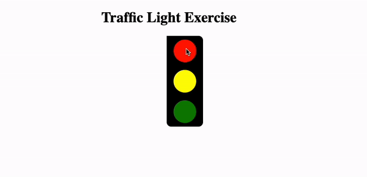

# 🚦 Traffic Light

<p align="center">
  
</p>

## Project Overview

Welcome to the React Traffic Light project! This project is a simple exercise that I completed during my studies while learning React in [4Geeks Academy](https://4geeks.com/). It serves as a basic demonstration of how React components work together to create a functional user interface.

## About the Project

The React Traffic Light is exactly what it sounds like—a digital traffic light sign that can change it's turned on light on the user's command. It's a minimalistic yet effective way to explore the fundamental concepts of React, specially the useState hook in a didactic way.

## 🔧 Requirements
Before diving into the game, ensure you have the following prerequisites installed:

[nodeJS](https://nodejs.org/en): Simple-Counter is built using React, based in javaScript, so make sure you have it installed node on your system.

## Cloning the Repository

To get started and run Pong Game on your local machine, follow these simple steps:

```bash
# Clone the repository
$ git clone https://github.com/jrdelrio/traffic-light.git

# Navigate to the project directory
$ cd traffic-light
```

## Running the project

```bash
$ npm start
```

## ENJOY !
Made with ❤️ by jrdelrio | Full Stack Developer